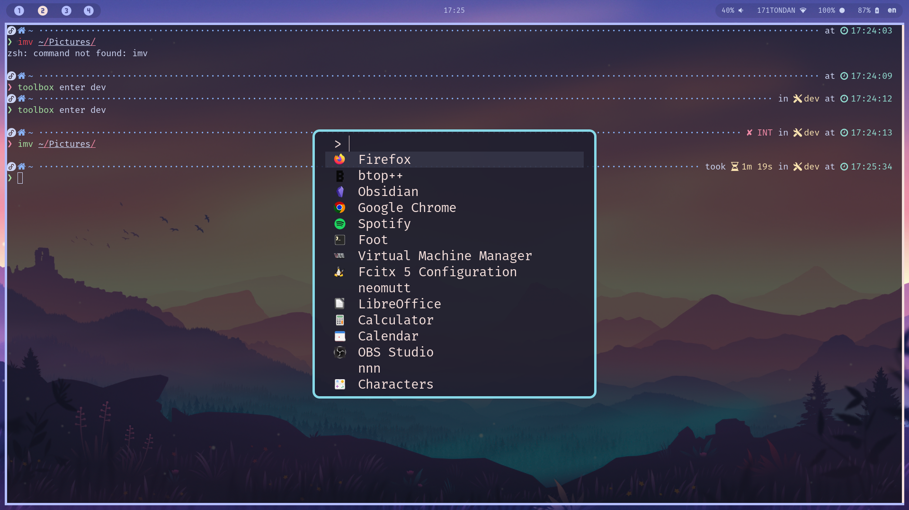
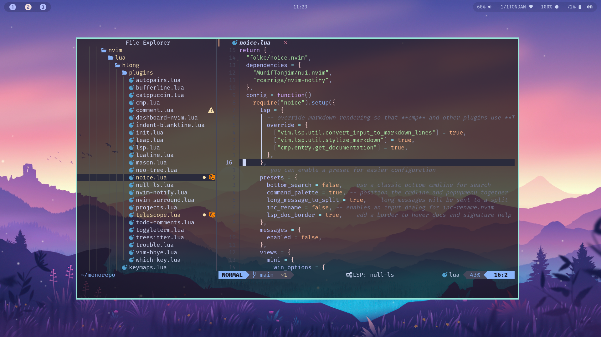

# Dotfiles

## Setup

Install [chezmoi](https://www.chezmoi.io/)

### Locally

```bash
chezmoi init https://github.com/vohoanglong0107/containers
```

### Server

For server or container

```bash
chezmoi init https://github.com/vohoanglong0107/containers --promptBool "Is this a server?"=true
```

## Screenshots

### Fuzzel



### Neovim

